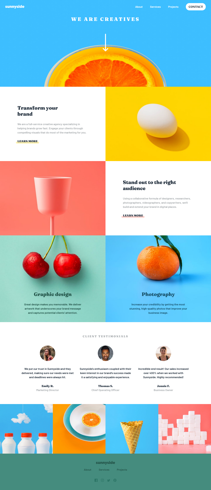

# Frontend Mentor - Sunnyside agency landing page solution

This is a solution to the [Sunnyside agency landing page challenge on Frontend Mentor](https://www.frontendmentor.io/challenges/sunnyside-agency-landing-page-7yVs3B6ef).

## Table of contents

- [The challenge](#the-challenge)
- [Screenshot](#screenshot)
- [Links](#links)
- [Built with](#built-with)
- [Author](#author)

### The challenge

Users should be able to:

- View the optimal layout for the site depending on their device's screen size
- See hover states for all interactive elements on the page

### Screenshot

### Links

- Solution URL: [Github](https://github.com/sangodare/sunnyside-landing-page.git)
- Live Site URL: [Live Site](https://sunnysidelandingpagebytoyeeb.netlify.app)

### Built with

- Semantic HTML5 markup
- Flexbox
- Mobile-first workflow

### Author

- Frontend Mentor - [@sangodare](https://www.frontendmentor.io/profile/sangodare)

